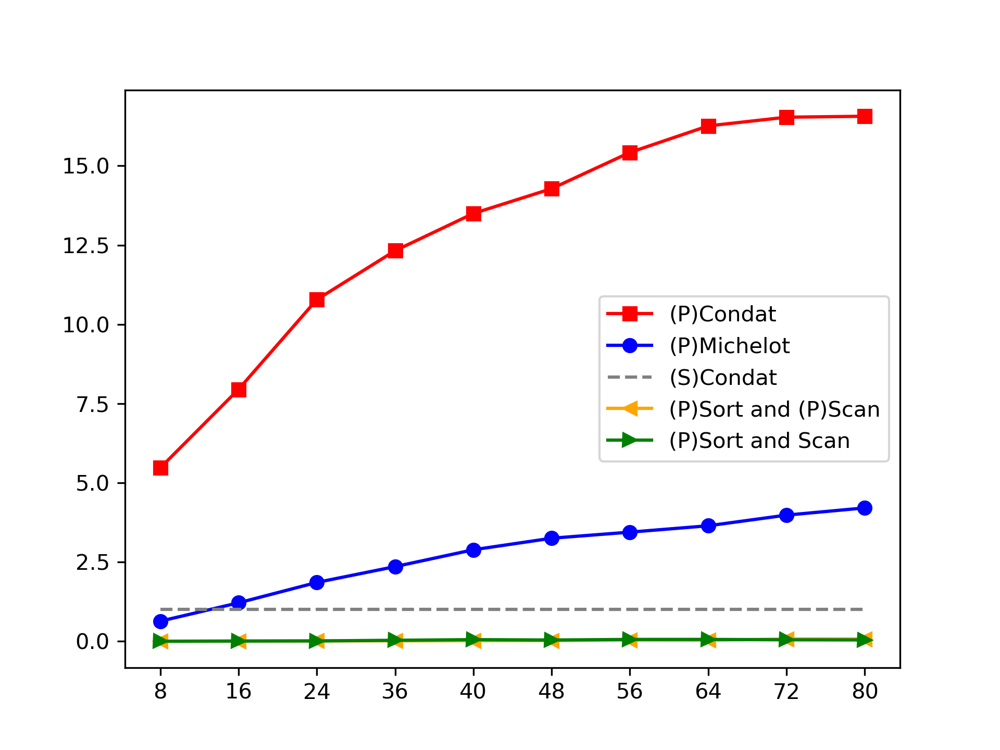
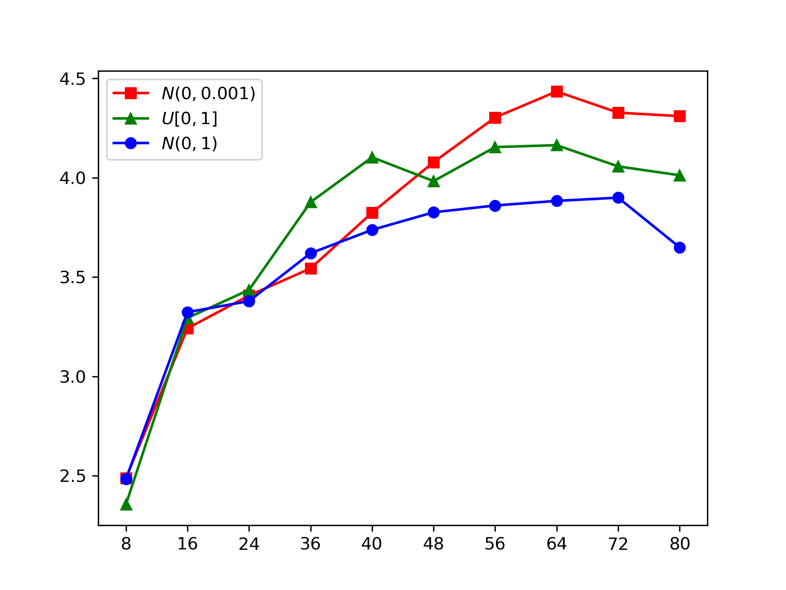

# Replicating Plots in [results](results)

We organize this tutorial by the type of projections. There are two ways to reproduce our plots. First, you can use our plot functions from our [python script](/src/plot_graphs.py). You need to generate the necessary runtime results from Julia scripts and send the results to Python. Then you can generate the plots in this folder. Second, since the runtime results may be variant in different devices or even different system statuses, we also provide our plotting files (in .ipynb) with runtime results reported in our paper. You also can generate the plot directly from these files.

## Projection onto a simplex

Run the script simplex_runtim_benchmark.jl in [src](src) with 80 cores (you can change the number of cores in the script based on your device), you can get runtime results for
- input vector $d$ with size of $10^8$ and distributions $U[0,1], N(0,1), N(0, 0.001)$; then you can get the plots: simplex_norm_comp.png, simplex_unif_comp.png, simplex_small_norm_comp.png, simplex_sortscan.png, simplex_michelot.png, simplex_condat.png;

- input vector with distribution $N(0,1)$ and size of $10^7, 10^8, 10^9$; then you can get the plots: simplex_107_comp.png, simplex_108_comp.png, simplex_109_comp.png, ss_mlen.png, sps_mlen.png, michelot_mlen.png, condat_mlen.png

Here is an example:

For the first way, generate runtime results from Julia firstly
```julia
> include("simplex_runtime_benchmark.jl")
> res_uniform_ss, res_standnorm_ss, res_smallnorm_ss, res_uniform_sps, res_standnorm_sps, res_smallnorm_sps, res_uniroms_m, res_standnorm_m, res_smallnorm_m, res_uniform_c, res_standnorm_c, res_smallnorm_c = get_result_length()
> simplex_unif_absolute = [res_uniform_ss[2:end]./res_uniform_c[1], res_uniform_sps[2:end]./res_uniform_c[1], res_uniform_m[2:end]./res_uniform_c[1], res_uniform_c[2:end]./res_uniform_c[1]]
> simplex_sortscan_relative = [res_uniform_ss[2:end]./res_uniform_ss[1], res_standnorm_ss[2:end]./res_standnorms[1], res_smallnorm_ss[2:end]./res_smallnorm_ss[1]]
```
Then, you can write simplex_unif_absolute to a file or directly copy it to Python

```python
>>> exec(open("plot_graphs.py").read())
>>> plot_absolute(simplex_unif_absolute, "simplex_unif_comp.png")
>>> plot_relative_simplex(simplex_sortscan_relative, "simplex_sortscan.png")
```

Then you get



For the second way, just upload simplex projection.ipynb and multiple length comparision.ipynb to JupyterNotebook with Python 3 kernal, then you can get the 14 plots.

## Projection onto an l1 ball

Run the script l1ball_runtime_benchmark.jl in [src](src) with 80 cores, you can get runtime results for input vector $d$ with the size of $10^8$ and distribution $N(0,1)$; then you can get the plots: l1ball_comp.png, l1ball.png

## Projections onto a weighted simplex

Run the script wsimplex_runtime_benchmark in [src](src) with 80 cores, you can get runtime results for input vector $d$ with the size of $10^8$ and distribution $N(0,1)$, and weight $w$ in $U[0,1]$; then you can get the plots: wsimplex_comp.png, wsimplex.png

## Projections onto a weighted l1 ball

Run the script l1ball_runtime_benchmark in [src](src) with 80 cores, you can get runtime results for input vector $d$ with the size of $10^8$ and distribution $N(0,1)$, and weight $w$ in $U[0,1]$; then you can get the plots: wl1ball_comp.png, wl1ball.png

## Projection onto a parity polytope

Run the script paritypolytope_runtime_benchmark in [src](src) with 80 cores, you can get runtime results for input vector $d$ with the size of $10^8-1$ and distribution $U[1,2]$; then you can get the plots: ppproject_comp.png, ppproject.png, pptotal_comp.png, pptotal.png.

## Lasso on real-world data

Run the script real_data_kdd10.jl and real_data_kdd12.jl in [src](src) with 80 cores, you can get runtime results for Lasso in [kdd2010](https://www.csie.ntu.edu.tw/~cjlin/libsvmtools/datasets/binary.html#kdd2010%20(algebra)) and [kdd2012](https://www.csie.ntu.edu.tw/~cjlin/libsvmtools/datasets/binary.html#kdd2012); then you can get the plots: kdd2010_comp.png, kdd2010.png, kdd2012_comp.png, kdd2012.png.
